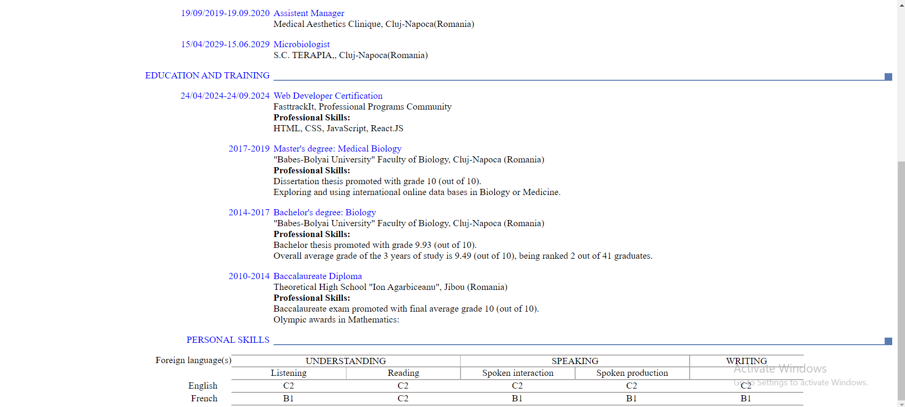

# A-CV-only-in-HTML5-CSS3
My first webpage created using only HTML5 and CSS3. 
Using semantic HTML (semantic elements tags like: article, header, section, or for styling: strong, em, etc.) and CSS3 Flexible Box Layout Module (flexbox, grid) I implemented a CV model as homemwork for my accredited Web Developer course. 

Here are some SCREENSHOTS to see some features of my project and code:

